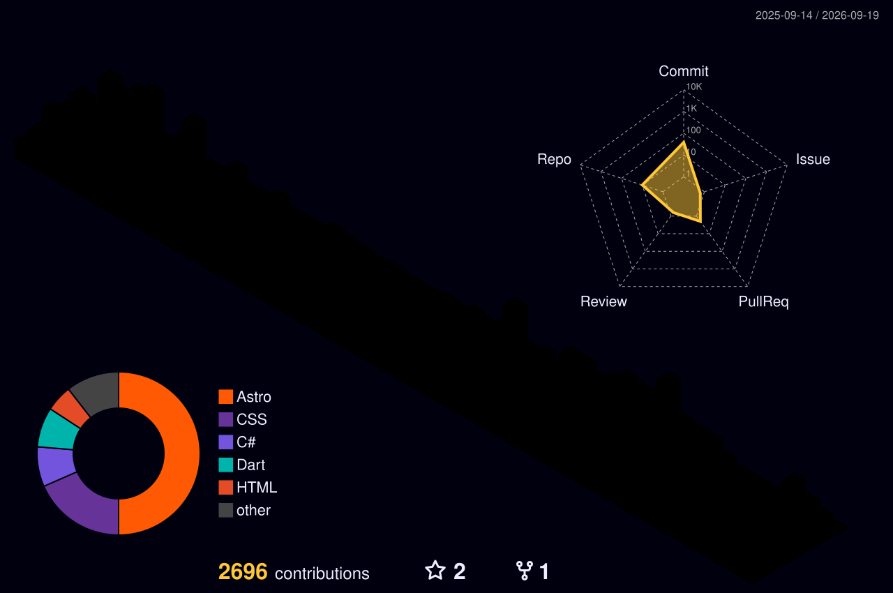

<em>I design and ship scalable digital products with modern web, mobile, and systems technologies.</em>

<!-- 

 -->

<!-- ---

## About

- Full-Stack Developer at **eTrade Myanmar**, where I lead the tech team and mentor developers on architecture and design.
- I built **MyanmarGoal** — a realtime football livescore platform (app, web CMS, backend) — from scratch and shipped it to production.
- I work across the whole stack: **Flutter** on mobile, **React / Next.js** on web, **.NET** on the backend, and **Figma** for the design that ties it together.
- I care about Clean Architecture, DDD, SOLID and TDD — and equally about pixel-perfect UI. Good products need both.
- Writing code since 2018. Based in **Yangon, Myanmar** 🇲🇲 -->

[**🌐 Portfolio**](https://kyawpyaephyo.dev) &nbsp;·&nbsp; [**📄 CV**](https://kyawpyaephyo.dev/cv)

<!-- --- -->

## Tech Stack

> **Bold brand colors** mark the four technologies I work in at expert level.

**Mobile**

**Frontend**

**Backend**

**Data & Infrastructure**

**Design**

<!--
**Also in my toolbox** — Clean Architecture · DDD · SOLID · TDD · realtime WebSockets & SignalR · Myanmar payment gateways (KBZPay, WavePay, 2C2P, TrueMoney) · App Store & Play Console releases

---

## GitHub Stats

---

## Contribution Activity

<picture>
  <source media="(prefers-color-scheme: dark)" srcset="https://raw.githubusercontent.com/Romanbot4/Romanbot4/output/github-contribution-grid-snake-dark.svg" />
  <source media="(prefers-color-scheme: light)" srcset="https://raw.githubusercontent.com/Romanbot4/Romanbot4/output/github-contribution-grid-snake.svg" />
  
</picture>

---

## Featured Projects

### ⚽ MyanmarGoal

Realtime football livescore platform — live match updates, standings, predictions, articles, videos, quiz games and push notifications. Backend serves **36k+ fixtures** and drives a bilingual (EN/MM) admin CMS.

`Flutter` `.NET` `React` `Next.js` `TypeScript` `Figma`

[Website](https://myanmargoal.com) · [Web App](https://web.myanmargoal.com) · [App Store](https://apps.apple.com/us/app/myanmar-goal/id6753875518) · [Google Play](https://play.google.com/store/apps/details?id=com.etm.myanmargoal) · [YouTube](https://www.youtube.com/@myanmargoalofficial)

### 🎬 ShweStream

Movie and TV streaming across mobile, web and marketing surfaces. The React SPA uses a layered architecture with dependency injection, **Shaka Player DRM playback**, phone+OTP auth and multi-gateway subscriptions.

`Flutter` `React` `Vite` `Redux` `Node.js` `TypeScript`

[Website](https://shwestream.com) · [Web Player](https://web.shwestream.com) · [App Store](https://apps.apple.com/mm/app/shwestream-movies/id1532865417) · [Google Play](https://play.google.com/store/apps/details?id=com.etm.shwestreammyanmar)

### 🎵 BlissBox

A free music player built on a **YouTube Music engine I reverse-engineered myself** — including PoToken & signature extraction and a custom HLS/DASH stream decoder. Structured as a Melos mono-repo of **18+ independently versioned Dart packages**.

`Flutter` `Dart` `Kotlin` `Java` `Figma`

[Live Demo](https://blissboxmusic.netlify.app/) · [Source & APK](https://github.com/Romanbot4/bliss_box_public)

### 🍜 Quick Food

Food delivery platform with realtime driver location, Google & OpenStreetMap integration, **face recognition via ML Kit**, **peer-to-peer voice calls over WebRTC**, multi-payment checkout and a merchant POS.

`Flutter` `Firebase` `Dart`

[App Store](https://apps.apple.com/mm/app/quick-food-myanmar/id6463413572) · [Google Play](https://play.google.com/store/apps/details?id=com.delivery.quickfood)

### ✨ Byoh

Premium lifestyle platform for articles, video content and social features.

`Flutter` `Node.js` `Figma`

[Website](https://byohls.com) · [App Store](https://apps.apple.com/ph/app/byoh-lifestyle/id6670603719) · [Google Play](https://play.google.com/store/apps/details?id=com.etm.smyouth)

### 💰 Ngwe Khin

A polished expense manager with Firebase auth and storage, statistics and budget breakdowns, plus an in-app self-update service that pulls straight from GitHub Releases.

`Flutter` `Firebase` `Dart`

[Source & APK](https://github.com/Romanbot4/ngwe_khin_public)

---

## Experience

### eTrade Myanmar Co., Ltd. — _Full-Stack Developer_

`Apr 2024 – Present` · Yangon, Myanmar

- Designed and delivered a realtime football livescore, quiz, streaming and social lifestyle platform — app, web CMS and backend — from scratch.
- Architected realtime, data-intensive backend systems for high performance and scalability.
- Led the tech team and mentored 2+ developers on design and architecture.

### app.com.mm (Hap Eye Co., Ltd.) — _Senior Mobile Developer_

`Jan 2024 – Apr 2024` · Remote

- Built multiple e-commerce applications with high fidelity to Figma designs.
- Shipped several Flutter apps to both the Google Play Store and the App Store.

### Efficient Soft Co., Ltd. — _Senior Mobile Developer_

`Dec 2022 – Jan 2024` · Yangon, Myanmar

- Shipped multiple Flutter apps to the Play Store and App Store, including Quick Food, Quick Food Rider and GG Luck.
- Led technical interviews and mentored 3+ junior Flutter developers on architecture best practices.

--- -->

## Let's Connect

**📍 Yangon, Myanmar** &nbsp;·&nbsp; **📞 +95 99 8368 3732** &nbsp;·&nbsp; Open to remote & on-site opportunities

